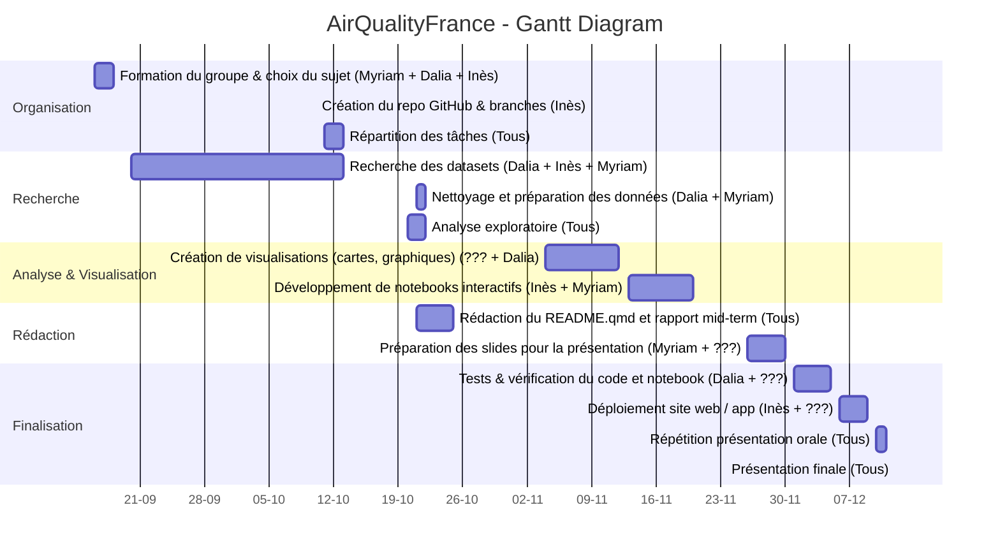

# my_module_name
## Introduction:

Nous avons décidé, d’un commun accord, de réaliser un site web sur **la qualité de l’air en France métropolitaine**. Nous analyserons l’évolution de la qualité de l’air en France entre **2020 et 2024**. Le public visé par ce site web sont **les personnes sensibles ou vulnérables** souhaitant identifier les ville dans laquelle elles peuvent s'épanouir sans compromettre leur santé physique. Ce sujet nous tientà coeur car malheureusement de plus en plus de personnes décédent chaque années à causes des maladies liée à une trop forte exposition à la pollution. 
Nous aimerions ainsi mieux comprendre :
- comment la qualité de l’air a évolué au fil des années,  
- quelles villes ont réussi à améliorer la situation,  
- et lesquelles rencontrent encore des difficultés à réduire la pollution.

## Problèmatique : Comment a évolué la qualité de l'air en France métropolitaine entre 2020 et 2024 ?

## Développement :

Pour répondre à ce sujet, nous allons créer un site web dans lequel on pourra voir l'évolution de la qualité de l'air entre 2020 et 2024. Les utilisateurs pourront utiliser des **cartes intercatives** affichant la pollution par ville, des **graphiques temporels** montrant l'évolution des polluants ainsi que ...
Pour s'organiser et réussir à allier la continuité du projet tout au long du semestre nous avons établit le diagramme de Gantt qui suit :

## Diagramme de Gantt – AirQualityFrance

Nous avons comme objectif que notre site ressemble aux croquis suivant qu'on a pu faire :

Concernant l'architecture du site, nous avons un dossier **data** où va se trouver toutes les datas qu'on va utiliser dans ce dossier on a deux sous dossiers, dans le premier il y a les datas brut et dans le deuxième se trouvera les datas qu'on a nettoyé. Nous avons également un dossier **images** dans lequel se trouve l'intégralité des croquis qu'on a pu faire et pour nous permettre de visualiser à quoi notre site doit aboutir. De plus, nous avons également un dossier **site** où va se trouver tout les fichiers menant à la création du site web. 

Concernant la pipeline, nous allons utiliser les packages suivants pour le traitement et la visualisation des données :
-pandas : manipulation et nettoyage des données
-numpy : calculs numériques
-matplotlib et seaborn : visualisations statistiques
-plotly ou leaflet : visualisations interactives (carte et graphiques dynamiques)
-quarto : génération du site web et intégration du rapport

Nous avons également créée des **branches gits**; la branche main qui est la version stable du projet, la branche **Data** dans laquelle on va étudier les datas et la branche **carte-interactive** dans laquelle on va créer les cartes interactives ainsi que la branche **site-web** dans laquelle on va créer le site web.

