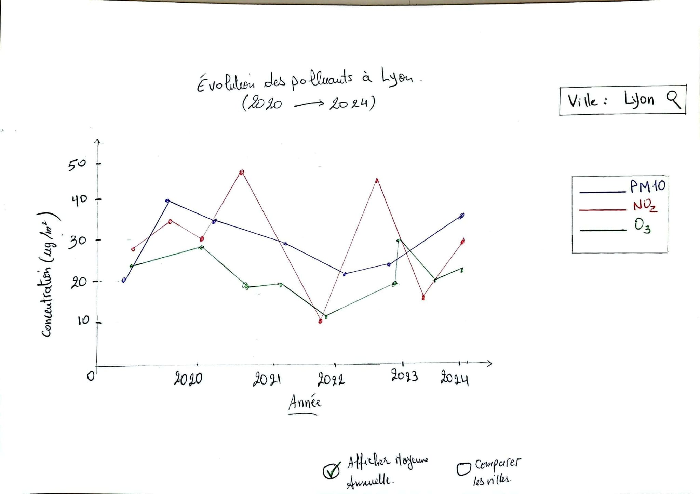
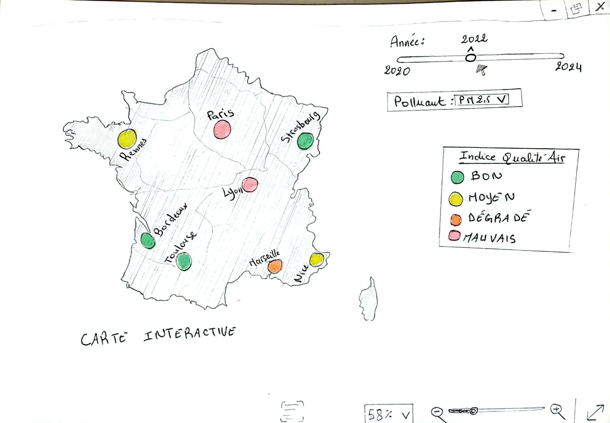
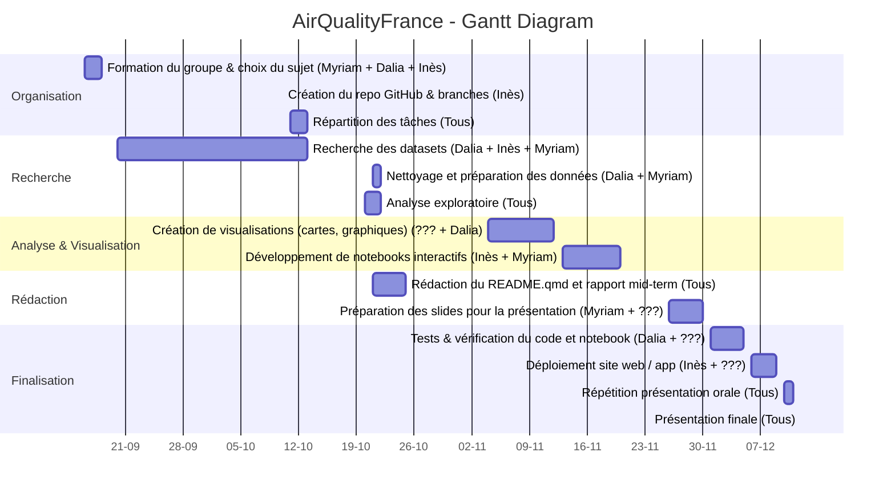

# AirQualityFrance
## Introduction:

Nous avons décidé, d’un commun accord, de réaliser un site web dédié à l'étude de **la qualité de l’air en France métropolitaine**. Ce projet vise à analyser l’évolution de la qualité de l’air sur la période **2020 et 2024** en se basant sur des données publiques et des visualisations intéractives. Le public visé par ce site web sont principalement **les personnes sensibles ou vulnérables** souhaitant identifier les villes dans lesquelles elles peuvent s'épanouir sans compromettre leur santé physique. Ce sujet nous tient particulièrement à cœur, car, malheureusement, on peut observer que  le nombre de personnes décédant chaque année des suites de maladies liées à une exposition excessive à la pollution ne cesse d’augmenter. Afin de prévenir certaines maladies ou d'éviter des dommages plus importants, il est essentiel d'analyser ce sujet en profondeur.
Nous aimerions ainsi mieux comprendre :
- comment la qualité de l’air a-t-elle évolué au fil des années,  
- quelles villes ont réussi à améliorer la situation,  
- et quelles sont celles qui rencontrent encore des difficultés à réduire la pollution.

## Problèmatique : Comment a évolué la qualité de l'air en France métropolitaine entre 2020 et 2024 ?

## Développement :

Pour répondre au mieux à ce sujet, nous allons créer un site web intéractif permettant de visualiser l'évolution de la qualité de l'air entre 2020 et 2024.
Les utilisateurs pourront :
- sélectionner l’année à l’aide d’un **curseur allant de 2020 à 2024**,
- choisir le polluant qu’ils souhaitent analyser (PM10, PM2,5 , NO2, O3...etc.),
-  consulter des **cartes intercatives** représentant le niveau de pollution dans les grandes villes françaises,
-  et observer des **graphiques temporels** illustrant la variation des principaux polluants sélectionnés pour chaque ville au fil des années.
  Nous avons comme objectif de réaliser un site qui ressemble aux mieux aux croquis qu'on a pu faire :

Graphique de tendance temporelle par ville. Ce graphique dynamique permet d'analyser l'évolution des concentrations (en $\mu \text{g}/\text{m}^3$) de plusieurs polluants sur la période 2020-2024. Il est essentiel pour répondre à la problématique, car il révèle les tendances d'amélioration ou de dégradation spécifiques à chaque métropole. L'utilisateur peut ainsi suivre si sa ville cible maintient ses efforts de réduction au fil des années.

Cet outil, centré sur la France métropolitaine, permet à l'utilisateur de visualiser immédiatement les niveaux de pollution (symbolisés par des codes couleurs) pour une année spécifique sélectionnée via le curseur temporel. Le menu déroulant offre un filtrage instantané par polluant (PM10, PM2,5 , O3... etc.), facilitant l'identification des zones à risque pour les personnes sensibles.

  Afin garantir une bonne organisation et réussir à allier la continuité du projet tout au long du semestre nous avons établit le diagramme de Gantt qui suit :

## Diagramme de Gantt – AirQualityFrance

# Architecture du projet : 

Concernant l'architecture du site, nous avons un dossier **data** où va se trouver toutes les datas qu'on va utiliser dans ce dossier on a deux sous dossiers, dans le premier il y a les datas brut et dans le deuxième se trouvera les datas qu'on a nettoyé. Nous avons également un dossier **images** dans lequel se trouve l'intégralité des croquis qu'on a pu faire et pour nous permettre de visualiser à quoi notre site doit aboutir. De plus, nous avons également un dossier **site** où va se trouver tout les fichiers menant à la création du site web. 

Concernant la pipeline, nous allons utiliser les packages suivants pour le traitement et la visualisation des données :

-'**pandas**' : manipulation et nettoyage des données

-'**numpy**' : calculs numériques

-'**matplotlib**' et '**seaborn**' : visualisations statistiques

-'**plotly**' ou '**leaflet**' : visualisations interactives (carte et graphiques dynamiques)

-'**quarto**' : génération du site web et intégration du rapport

Nous avons également créée des **branches gits**; la branche **main** qui est la version stable du projet, la branche **Data** dans laquelle on va étudier les datas et la branche **carte-interactive** dans laquelle on va créer les cartes interactives ainsi que la branche **site-web** dans laquelle on va créer le site web.

*Le choix de la plateforme Geod'air* (GEstion des données d'Observation de la qualité de l'AIR) est à la fois rigoureux et stratégique, car elle représente la base de données nationale de référence sur la qualité de l'air en France. Gérée par l'INERIS (Institut National de l'Environnement industriel et des RISques) et le LCSQA (Laboratoire Central de Surveillance de la Qualité de l'Air), cette source garantit la fiabilité et l'exactitude des mesures de polluants (PM10, PM2,5 , NO2,... etc.) pour la période 2020-2024 que nous étudions. Geod'air centralise les données de toutes les AASQA( Association Agréée de Surveillance de la Qualité de l'Air), assurant une couverture complète de la France métropolitaine, essentielle pour nos cartes comparatives. De plus, son accessibilité via des exports CSV et son API simplifient grandement l'intégration et le traitement des données dans notre pipeline technique Python/Quarto.

## Conclusion
Ce projet nous permettra de meiux comprendre et de mieux visualiser l'impact de la pollution sur la population française et de sensibiliser le public à l'importance de la qualté de l'air. Grâce à la visualisation interactive des données, les utilisateurs pourront identifier plus facilement les zones à risque et suivre l’évolution des efforts de réduction de la pollution dans différentes villes françaises. C'est aussi très importants car la pollution contribue à l’augmentation des maladies respiratoires et affecte directement la santé des habitants. On espére que ce site pourra sensibiliser le public et aider à prendre conscience de l’importance de préserver la qualité de l’air. Parce que c'est aujourd'hui que nous construisons notre future.

## Informations générales

**Nom du projet :** AirQualityFrance  

**Groupe :** Myriam El Idrissi, Dalia Remila, Inès Camus, (Rachida)

**Université :** Université de Montpellier  

**Date :** Octobre 2025

**Sources données :** https://www.geodair.fr/donnees/consultation

