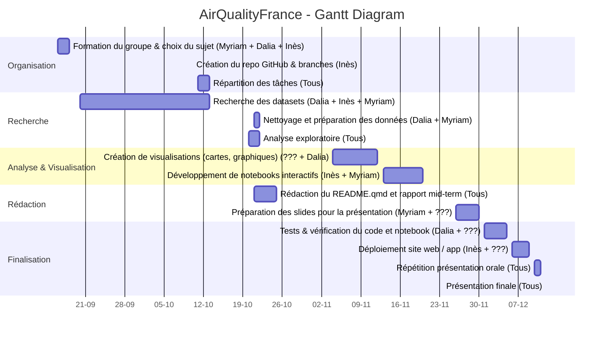

# my_module_name
Introduction:

Nous avons décidé, d’un commun accord, de réaliser un site web sur la qualité de l’air en France métropolitaine. Nous analyserons l’évolution de la qualité de l’air en France entre 2020 et 2024. Malheureusement, nous n’avons pas encore étudié les données de cette année, car les datasets ne sont pas encore complets.
Ce sujet est important pour nous, on aimerais bien en apprendre plus sur l'évolution de la polution de l'air et notamment la différence entre chaque ville, et voir si des villes arrievnt à améliorer la qualité de l'air et si d'autres justement n'y arrivent pas.

Problèmatique : Comment a évolué la qualité de l'air en France métropolitaine entre 2020 et 2024 ?

Développement :

Pour répondre à ce sujet, nous allons créer un site web dans lequel se trouvera des cartes interactives ou on pourra voir l'évolution de la qualité de l'air entre 2020 et 2024. Pour s'organiser et réussir à allier la continuité du projet tout au long du semestre nous avosn établit le diagramme de Gantt qui suit :

## Diagramme de Gantt – AirQualityFrance

Nous avons comme objectif que notre site ressemble aux croquis suivant qu'on a pu faire :

